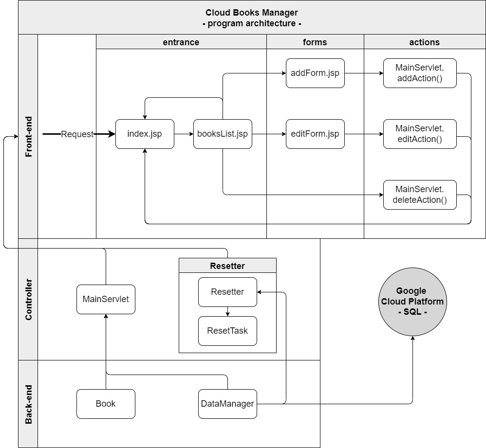
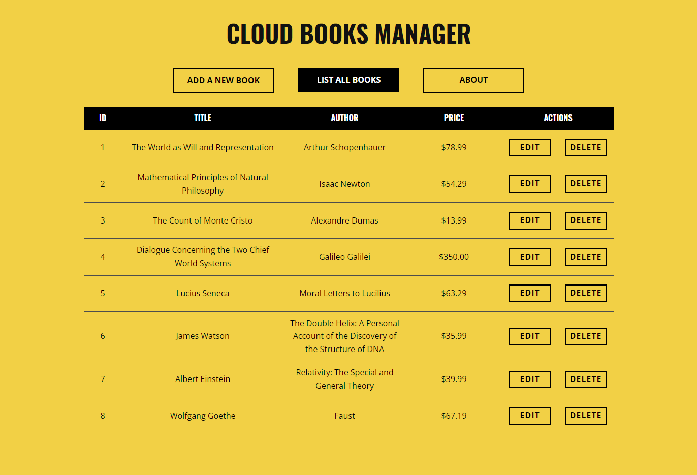
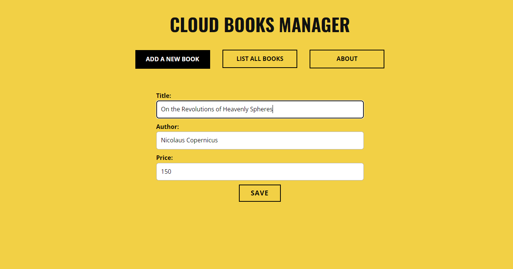
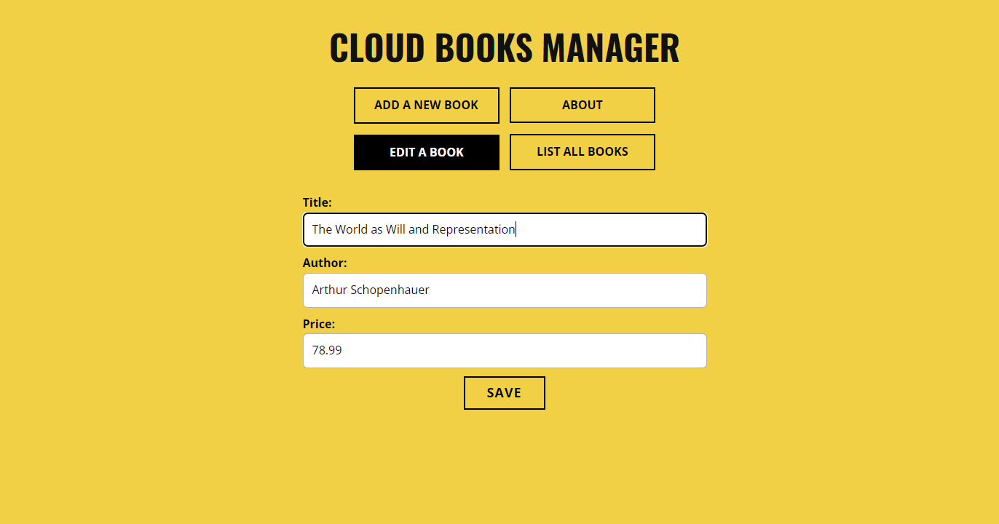

# Cloud Books Manager  

## Table of Contents
1. [Basic Info](#Basic-Info)
2. [Features](#Features)
3. [Deployment](#Deployment)
4. [Architecture](#Architecture)
5. [Screenshots](#Screenshots)
6. [License](#License)

## Basic Info
This program is a books manager web-application which allows to browse and edit stored data. The data is stored in a cloud database at Google Cloud Platform.
| Parameter                               | Data                                                                                                    |
| :-------------------------------------: | :-----------------------------------------------------------------------------------------------------: |
| Program name:                           | Cloud Books Manager                                                                                     |
| Date of creation:                       | February 2022                                                                                           |
| Technologies used:                      | Java SE, Java Servlets,  Java Server Pages, MySQL, Google Cloud Platform, HTML, CSS, Maven  |
| Time spent to   create the program: | ~2.5 days                                                                                               |
| Author:                                 | Herman Ciechanowiec   herman@ciechanowiec.eu                                                        |
| License:                                | MIT No Attribution License                                                                              |

## Features
The program has the following features:
- supported actions: list all stored books, add a new book, delete a stored book, edit a stored book
- in order to cancel possible inappropriate entries made by anonymous users, every day the program automatically resets the whole database and inputs 10 default entries
- data is stored in a remote MySQL database running at Google Cloud Platform
- handling of prohibited user’s actions and program errors

## Deployment
The program was deployed at Heroku platform (herokuapp.com) as a WAR file through Heroku Maven Plugin. Instructions regarding this way of deployment can be found here: https://devcenter.heroku.com/articles/deploying-java-applications-with-the-heroku-maven-plugin.

## Architecture
The program is divided into three parts: front-end (graphical user interface), back-end (logic of the program) and the controller, which handles a relationship between the front-end and the back-end. The connection with Google Cloud Platform is established at the back-end level:  

## Screenshots
<kbd></kbd>  
<kbd></kbd>  
<kbd></kbd> 

## License
The program is subject to MIT No Attribution License

Copyright © 2022 Herman Ciechanowiec

Permission is hereby granted, free of charge, to any person obtaining a copy of this
software and associated documentation files (the "Software"), to deal in the Software
without restriction, including without limitation the rights to use, copy, modify,
merge, publish, distribute, sublicense, and/or sell copies of the Software, and to
permit persons to whom the Software is furnished to do so.

The Software is provided "as is", without warranty of any kind, express or implied,
including but not limited to the warranties of merchantability, fitness for a
particular purpose and noninfringement. In no event shall the authors or copyright
holders be liable for any claim, damages or other liability, whether in an action
of contract, tort or otherwise, arising from, out of or in connection with the
Software or the use or other dealings in the Software.
